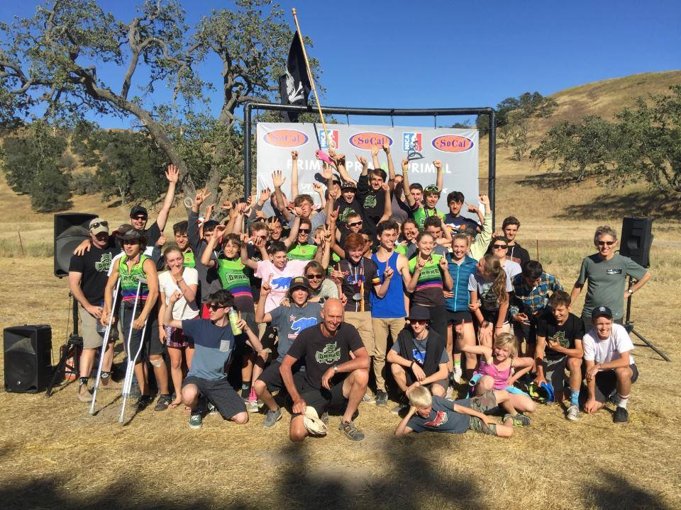
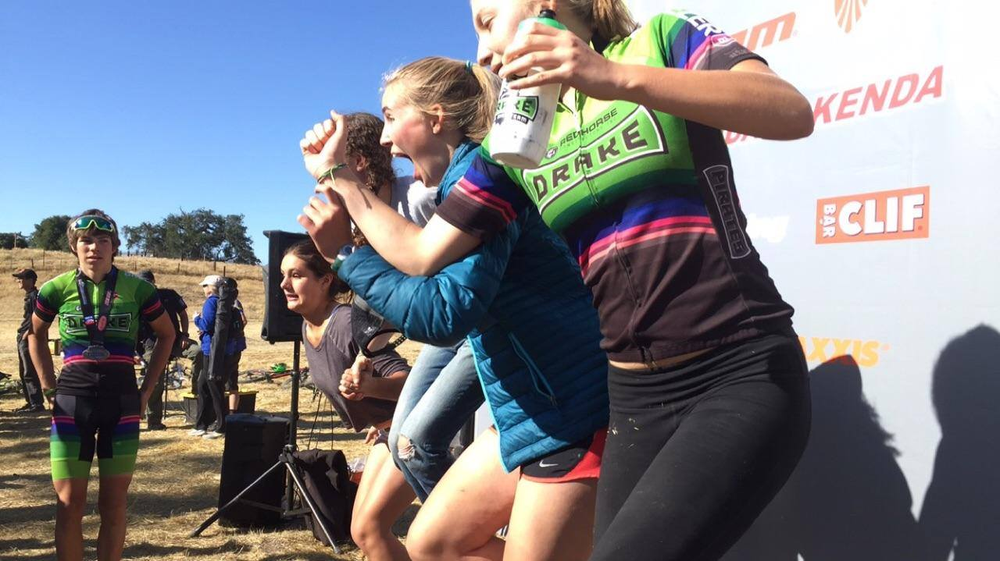

Drake HS, 2016 State Champions 2016! An incredible effort from all of our riders and a fantastic end to 2016! We look forward to next years season.

Howdy! Here is another great video from Brnnan Healy!

<iframe width="854" height="480" src="https://www.youtube.com/embed/M23T6-XmA2I" frameborder="0" allowfullscreen></iframe>

Photos from this event are here..
**COMMING SOON**

## Now for the Race Reports! (check back this page will change!)

#### Team Race Report

Congratulations to Drake MTB 2016!  

You stepped up and defended your title with style and grace. All the parents, coaches, the Galley and of course the riders dropped the hammer and rose to the top step on the podium in a very hard fought race.

Socal is coming for us now. For the first time in the history of the State Championships, they made the podium in D1 and finished 2,3 and 4 (with only 1 point between each place). Many of the Socal teams run deep with strong young riders. Look out, they will be coming at us next year in Norcal.

You work hard and succeed as a team. As coaches, we know that every rider’s contribution is not only important but critical. Your role is broad and ranges from supporting each other to finishing strong across the finish line. Its your camaraderie that motivates you to try harder for yourself and your teammates. Its a characteristic of the team that is unique and special to Drake. And, we think its why you win again and again. Yes, you are very fast but you are so much more than just fast riders to one another and it comes through loud and clear to us and the rest of the teams. All you do for one another is widely recognized by all the leagues and its so important - hang on to it!!! 

This race we would like to recognize some special efforts.

This was Dean Lyons last race for Drake. He started the race with the best Drake performance in the Varsity State Championships since Lucas Newcomb (2x National Champion) when Dean suffered a mechanical and slipped back in the field. Dean handled it like a pro. He put his head down and finished. Its been a pleasure to see him grow as a person and a rider during the last 4 years. And, an extra special shout out to Dean for rising above that disease known as “senioritis” and finishing the season determined to give it all he had. 

Dylan Fryer started LAST in the JV field of 92 and like Houdini appeared at the front at the top of the first climb. He put in an amazing effort and did what he does best - flies like the wind.

Otis Lyons rode an incredible ride and fought hard - finished 2nd in D1 Freshman Boys by only 10 seconds.

Ronan Goulden rolled around in 10th place at the end of the first lap and decided to make his move to the front of the pack at the start of the single track hill on lap 2. He never looked back. Congrats to Ronan - Sophomore State D1 Champion.

Marya rode a fantastic race as a first year Varsity rider and finished 11th. Look out Varsity ladies. She is going to continue to grow stronger every race (especially if she keeps eating so well before she rides:).

We all experienced good lessons this year and felt the ups and downs of competition. Keep doing what works and never forget how good it feels to overcome the challenges. Each season will bring new experiences and you’ll have the chance to continue building with every ride. Be the best you can be, have fun and everything else will fall into place. 

Congratulations - you earned it!

Sarah Starbird 
Otis Guy 
Head Coaches 
Sir Francis Drake HS Mountain Bike Team 
<http://www.Drakemtb.org>

****

#### Eric

I've never done particularly well at states. In my freshmen year I flatted at the beginning of the first climb at Laguna Seca and last year I did better. I managed to finish the race in 50ish pace so going into this race I wanted to finish around that same spot. It wasn't fun waking up at 4am to go down on Saturday but I got to sleep in the car. I helped set up the pit zone at noon and then went on the preride shortly after with two riders and Otis Guy. We took it easy and I found the course to be kinda the same as I remembered it. It was bumpy, dusty, and had that hard uphill section at the beginning. When I finished everyone else was going to preride and so I hung out.

After we went to the hotel, I showered. relaxed, and then went to dinner. It was nice to have dinner with friends and I went to bed early, feeling tired from waking up at 4.
On race day I woke up at around 7 and my family and I were a bit later than normal. I had a breakfast burrito and hung out at the pit zone taking pictures. Before the boys started (which was weird because they were first) I went up to where the fire road after the feed zone turns into single track to cheer people on. I went with Walden and Ben and some other people were there. After the boys went I went back to the pit zone and had some light snacks and drank a bit of water. I watched the girls go off and then went and ate some tri-tip and rice. After that I hung out and changed into my Drake kit. I hung out some more, moved a trainer into the shade near the mechanics tent and put my bike on it, and started warming up at about 12:45. Then I lined up for the start line, got into my place around the middle of the pack and was off.

The start was fast and I tried to get a good spot before it turned into single track. Before the feed zone I could feel that my quads were in a bit of pain but I put this down to a not too good warm up. I settled into a pack and managed to pass a few people on the single track leading up to the steep uphill. I powered up the hill and felt like I was in a good spot. A little bit before the halfway point my stomach started to hurt. Just before the fire-road uphill I passed my Dad as he cheered on. I passed under the tree with the hammocks/enos and all the Drake riders cheering me on. By this point I still wasn't feeling well. I heard my Mom cheering me on as I passed by and on to my second lap really not feeling that well at this point. 

Going up the small hill to the feed zone hurt my legs and stomach and I got a new water bottle as I passed by. On the single track before the steep hill a rider passed me and told me to "have a good race.' He then followed up that with "I could really go for a cheeseburger right now, double patty." and I thought that if I had one I would probably throw up. Going up the uphill hurt a lot and I felt horrible. Around halfway through the second lap I found that the smaller bumps made my stomach hurt more but the bigger bumps, like the ones that would loosen your water bottle, didn't, which I found interesting. As I passed my Dad again he asked if I was feeling well and I shook my head. I passed the tree with the hammocks again feeling really bad and not sure if I could do another lap. I heard my Mom cheer me was I passed by and at this point I had decided that I couldn't do another lap. I couldn't ride that steep uphill without throwing up. I heard Rob Reed cheer me on and Bill announce my name and I pulled off of the race course. 

The lady asked me if i was finishing or DNFing. I managed to say "DNF," as I rested my elbows on my handlebars. I saw Rob Reed run over to me. I shall quote Rob reed on this next part because I feel like he explains it very well, "Yesterday I was at the finish line for lap two for the JV riders, cheering them on, and Eric came into view. Eric looked up when I yelled "Double E!!!" and slowly looked back down.  He came off the course, looked up again.  I gave him a hug, and he just sort of collapsed into me and shook or cried or something... I know my eyes clouded up.  Just held him for a minute or so, didn't say a word.  Then I made sure he had a place to sit in the shade, and he did, quietly." After that the coaches came over and checked up on me. Alec also came over and sat next to me silently. After I felt a bit better I got up and went back to the pit zone and changed. The feeling went away after a while and I feel better now. I'm still not positive on what could have caused it but I think it may have been that I didn't hydrate properly. 

The support from everyone was amazing. I had a horrible race but everyone was so nice and supportive. This is why the Drake Team is so amazing. Everyone is there to support you no matter how you do in a race and that''s the amazing thing about it. Thank you to all the coaches, ride leaders, parents, riders, Sarah, Otis, and also to Rob Reed. Thank you guys for an amazing season and another State Championship. We all worked hard together and it payed off. 
Sorry for the long race report and Roll Pirates!

Eric Enbom 
JV 
DNF 

****