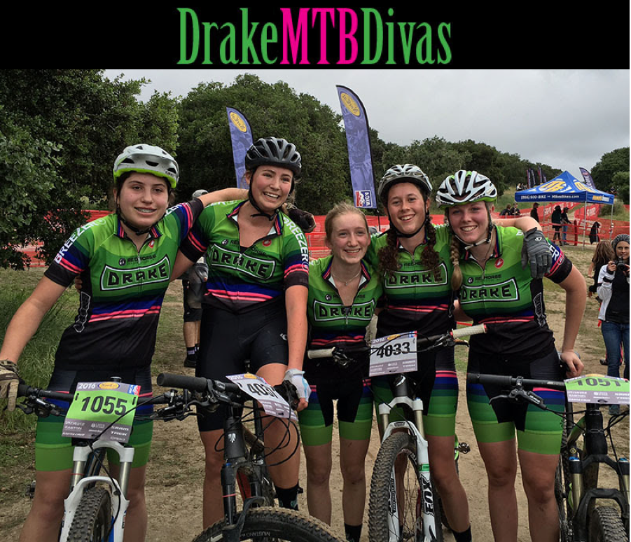
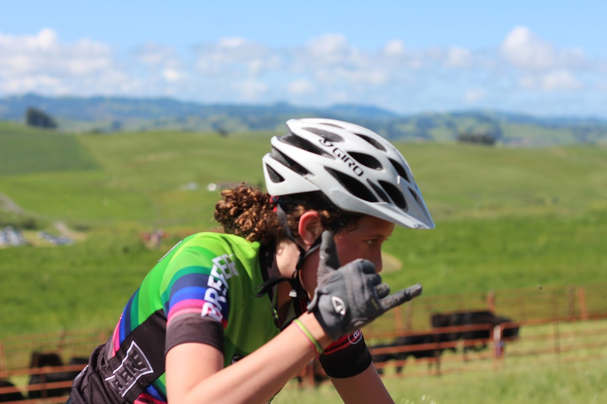

#### Stella Greeenwood - sophmore

****

#### Elise Nicol - sophmore

I ride because it gives me freedom, joy and a sense of being part of something much larger than just me. Before the Drake team, I had not been part of a team or involved in sports. I didn't feel a sense of belonging and that people had my back no matter what. Now I am part of a family that supports and encourages me in all parts of my life. Mountain biking has made me happier, more fit, and more confident. I look forward to practice because I can escape from stress and be outdoors. I ride for fun, friends, well-being, to push myself, and because I love it. 

****

#### Uma Teesdale - junior varsity

****

#### Aliyah Trimble sophmore

I love mountain biking and I love being a part of a supportive team. The Drake mountain biking team is all those things and more. The atmosphere is super welcoming.  Being with the team, coaches and parents feels like being apart of a big supportive family. Everybody is amazing which makes riding with them super fun. The races are also a blast! It’s a great experience. 

****

#### Lily Willis sophmore

There is wind on my face, cooling the sweat. I am surrounded by people who love me and whom I love. Breathing hard, I am alert, focused, happy. I am on a team ride. 
I ride for the people. Lots of my all-time favorite people are on this team. The community of loving, supportive people is a must-have in high school, and no one does it better than Drake MTB!
Not to mention the strength I've built over the seasons. Not only physical, though no one can deny we are fit, but mental and emotional. I've pushed myself beyond everything I thought I was capable of, and grown into a stronger person because of it. 
And what fun it is! I can picture us girls after our race, on our feet, despite the long day, cheering our boys on with unconditional love and energy. It is the best image of our supportive community I can conjure up. 
We may be the Drake MTB Divas, but we are not your average diva. We are loving, strong, supportive, and fun-loving girls who ride their bikes. A lot. 

****

#### Jade Zaleski sophmore

I started mnt biking because I loved the idea of fun downhills, and that their was a whole team for it at Drake high school. I now know it is a lot more work than just fun downhills, its a great workout each day. I never thought racing would be so much fun either, but it is such an awsome supportive community that I wouldn't have it any other way! The team is amazing!

****

#### Hannah Childress - junior varsity

****

####Marya Smith - varsity

Growing up at the foot of Mt. Tam and Fairfax (Mountain Biking state capitol) I couldn’t wait to get my bike on the mountain from the second I took off the training wheels. Growing up just riding with my dad and then going to bike camps in the summer I was eager to start up on the team when I got to Drake. Even while being a little hesitant and nervous about the racing in the beginning, I decided why not be different and try something new! (Also the sport was in desperate need of some girl power). Starting off as a freshman rider, over the years I have grown to become a more skilled rider as well as develop a strong understanding of the team and our strengths and weaknesses as a whole. As a strong freshman rider I grew to move onto to JV my sophomore year skipping over the sophomore category and now racing Varsity as a Junior. As a captain time I strive to serve as a role model to younger riders (especially for the small number of girls on the team (only 9!) and help build a strong and supportive community that motivates and encourages riders to work hard at practice and races but also have lots and lots of fun! Mountain biking is not only an awesome group of kids but an even better sport that encompasses both my love for the outdoors, being active, and chit chatting away with my friends! Biking will forever be a part of my life and I can't wait to see where it takes me in the future! 

****

#### Lisette Werba - junior varsity

****