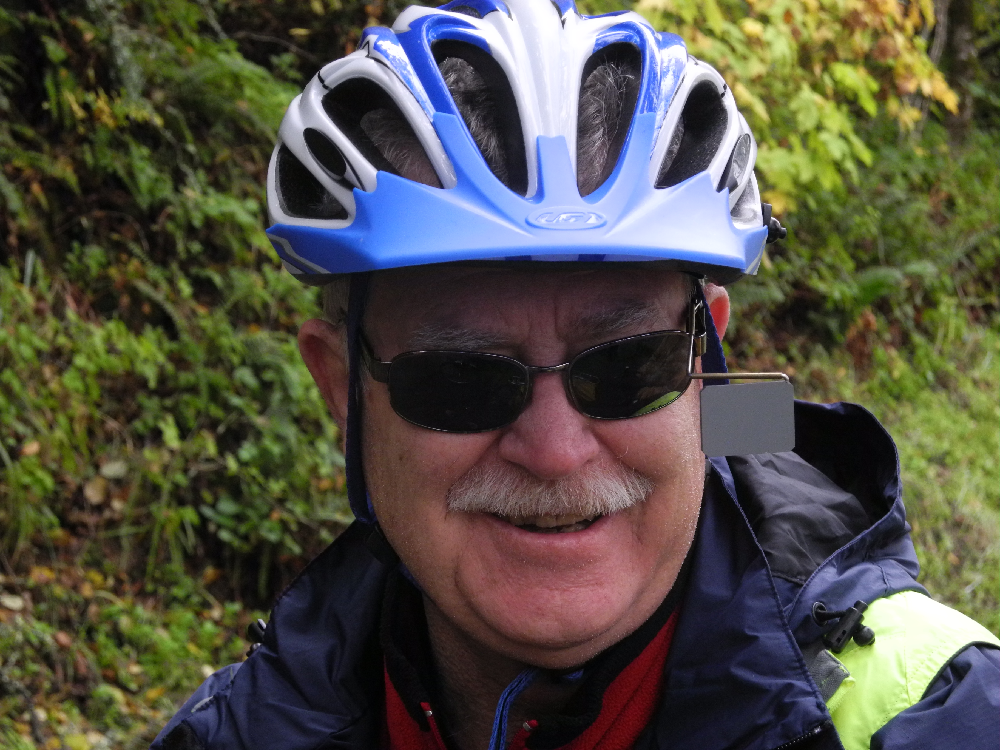
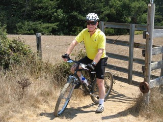

**This fund** was created to honor **Dr. James Miller**, who practiced orthodontics for forty-two years, improving the smiles of generations of Drake students. In addition, **Jim** was president of the Lagunitas District School Board and the Ross Valley Rotary Club, where he served for twenty-eight years. He was a well known runner, participating in over twenty-five runnings of the historic Dipsea race, and eleven of the grueling Double Dipsea, highlighted by two black shirts (22 and 33) in the Dipsea and eleventh place in the Double. Later on, **Jim** took up mountain and road biking, co-founding the **Old Spokes Bicycling Club**.

**An enormously gifted athlete**, **Jim** was **agile** and **fearless** on his mountain bike. He also did decades of volunteer consulting at **UCSF**, decades leading wilderness trips for the Sierra Club, several seasons coaching youth soccer, and a multitude of other charitable activities, improving community wherever he went.

**The scholarship funds** collected will **support** deserving Drake MTB **student**(s)-**athlete**(s) with financial need. Check back to this webpage for updates on the students and their success stories!

If you would like to make a **donations**, please make the checks...

Payable to: Drake MTB

Note in the Memo line: For "Jim Miller Memorial Fund."

Mail to: 
Drake MTB 
c/o Philip Nicol 
60 Cordone Drive 
San Anselmo, CA 94960

Thank you for your contribution.

<iframe width="560" height="315" src="https://www.youtube.com/embed/Q1W5G0LjVPQ" frameborder="0" allowfullscreen="">
</iframe>

